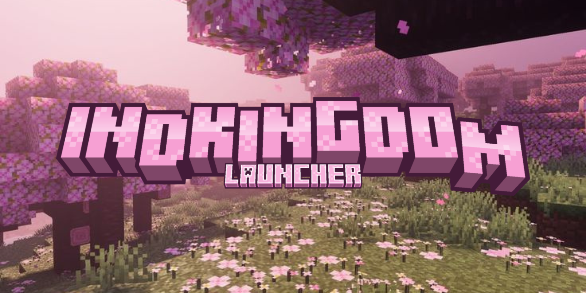

<p align="center">
  
</p>

<h1 align="center">IDK Launcher</h1>

<p align="center">
  <strong>The next-generation, high-performance, and beautifully sandboxed Minecraft experience.</strong>
</p>

<p align="center">
  <a href="https://github.com/Jeflacc/idk-launcher/releases/latest">
    
  </a>
  
  
</p>

---

## ✨ Overview

**IDK Launcher** is a state-of-the-art Minecraft client manager built from the ground up to prioritize speed, visual beauty, and complete user freedom. Bypassing traditional cluttered launchers, it offers a glassmorphic user interface designed to make modpack management, runtime configuration, multiplayer social features, and profile loading completely effortless.

## 📸 Demo

<p align="center">
  
</p>

<p align="center">
  <em>Modern glassmorphic UI with theme customization and background effects</em>
</p>

**Key UI Highlights:**

- 🎨 **Theme System** — Switch between built-in color themes (Green, Violet, Azure, Ember) with instant application
- ✨ **Background Effects** — Canvas-based particle and visual effects with intensity control
- 🪟 **Glassmorphic Design** — Modern glass-effect UI with smooth hover states, glow effects, and micro-animations
- 📱 **Responsive Layout** — Classic and Advanced modes for different user preferences

---

## 🚀 Key Features

### 📦 Modpack & Version Management
* **Sandbox Modpack Isolation** — Create and configure multiple persistent modpack profiles, each fully sandboxed in its own directory. No folder clutter or directory conflicts.
* **Import & Export** — Import CurseForge and Modrinth modpack archives from local `.zip` files, or export your own modpacks as portable CurseForge-compliant archives.
* **Version Mods Management** — Install, remove, and browse mods, resource packs, and shaders for any downloaded vanilla version — not just modpacks.
* **Multi-Loader Support** — Fabric, Forge, NeoForge, Quilt, and Vanilla — auto-detected from folder structure and configurable per version.

### 🧩 Marketplace & Mod Tools
* **Live Marketplace Integration** — Search and install thousands of mods directly from the launcher via **Modrinth** and **CurseForge**.
* **Mod Update Checker** — Automatically scans installed mods and resource packs for newer versions on Modrinth and CurseForge with one-click update and version picker.
* **Mod Dependency Resolver** — Detects missing mod dependencies and offers one-click auto-install from Modrinth.
* **Parallel Download Queue** — Downloads up to 12 files concurrently with automatic retry, integrity verification, and per-file cancellation.

### 👥 IDK Connect — Social & Multiplayer
* **Friends System** — Add friends, manage your list, and view real-time online status and game activity.
* **Direct Messaging** — Real-time chat with friends backed by persistent storage, unread badges, and speech bubble UI.
* **LAN Sharing** — Share your local game with friends over the internet using automated frpc tunneling — no port forwarding required.
* **Search & Profile Panels** — Search for users, view skin renders, bio, and manage friend requests from a dedicated sidebar.

### 🎮 In-Game Overlay
* **Borderless Fullscreen Overlay** — Transparent overlay that tracks the Minecraft window, toggled with **Shift+Tab**.
* **Live Tunnel Status** — Displays frpc download progress and multiplayer connection info directly in the overlay.

> **Source:** The overlay implementation lives in [`src/features/overlay/`](src/features/overlay/) (`overlay.html`, `overlay.js`, `overlay.css`).

### 🦊 Authentication & Skins
* **Multi-Auth Support** — Offline mode, **Ely.by** (OAuth2 browser flow + credential login), and **Microsoft** premium authentication.
* **Native Custom Skins** — High-fidelity integration with the Ely.by Skins System, rendering custom player skins directly on the canvas.
* **Microsoft Skin Management** — Upload and equip skins and capes directly from the launcher via the Minecraft Services API.

### 👤 Profile & Stats
* **Profile Page** — Dedicated profile tab with username, account type, playtime, modpack count, and achievements.
* **3D Skin Viewer** — Interactive `skinview3d`-powered 3D character viewer with rotation, zoom, and animation controls.
* **Live Achievements Tracker** — Recursively scans all save files across modpacks and vanilla versions to aggregate completed advancements.
* **Discord Rich Presence** — Automatic activity status showing what you're playing, with playtime timer and game invite join buttons.

### ⚡ Performance & Launch
* **Custom JVM Arguments** — Configurable global JVM arguments passed to every launch for GC tuning, memory flags, and other optimizations.
* **Auto-Java Detection & Install** — Automatically finds or downloads the correct Java version (8, 17, 21, 25) per Minecraft version.
* **Auto-Healer Recovery** — Detects corrupted JARs, Java version mismatches, and missing dependencies at runtime with automatic fixes.
* **Near-Instant Launching** — Bypasses file integrity checksums for files already on disk, and frees renderer memory on game start.

### 🎨 UI & Theming
* **Multi-Theme Color System** — Choose from built-in launcher themes (Green, Violet, Azure, Ember) with instant application.
* **Classic & Advanced Modes** — Switch between a clean simple layout and a feature-rich power-user layout.
* **Customizable Appearance** — Adjustable border radius, animation speed, font scale, blur intensity, and compact mode.
* **Background Effects** — Canvas-based particle and visual effects with intensity control.
* **Glassmorphic Design** — Modern glass-effect UI with smooth hover states, glow effects, and micro-animations throughout.

### 🛡️ Reliability & Diagnostics
* **Crash Report Analyzer** — Automatically parses Minecraft crash reports, detects common causes, and provides actionable fix suggestions.
* **Auto-Update Notifications** — Background version checker with in-app upgrade alerts and one-click download.
* **Error Display Component** — User-friendly error overlay with stack trace and recovery options instead of silent failures.
* **First-Run Tutorial** — Guided onboarding tutorial for new users.

---

## 💻 Tech Stack

* **Frontend:** [Vite](https://vite.dev/) + Vanilla HTML5/CSS3 with CSS custom properties for theming
* **Core Bridge:** [Electron](https://www.electronjs.org/) + Secure Context Bridge Preloads
* **Backend:** Node.js CommonJS modules for IPC handlers, auth, downloads, and system integration
* **Package Manager:** [npm](https://www.npmjs.com/)
* **Engine:** [Node.js](https://nodejs.org/) v20+

---

## 📦 Developer Guide (Local Run)

If you would like to run the launcher in a local development environment:

### Prerequisites
* [Node.js v20+](https://nodejs.org/)

### Setup and Start
1. **Clone the repository:**
   ```bash
   git clone https://github.com/Jeflacc/idk-launcher.git
   cd idk-launcher
   ```
2. **Install all dependencies:**
   ```bash
   npm install
   ```
3. **Run in development mode:**
   ```bash
   npm run dev:electron
   ```

### Testing
```bash
npm run test          # Run all tests
npm run test:watch    # Watch mode
npm run build         # Verify production build
```

---

## 🛠️ Compile Scripts

* **Windows compilation:** `npm run dist:win`
* **macOS compilation (on macOS):** `npm run dist:mac`
* **Linux compilation (on Linux):** `npm run dist:linux`
* **Compile all packages:** `npm run dist:all`

---

<p align="center">
  Built with 💖 by the community for players who demand excellence.
</p>
